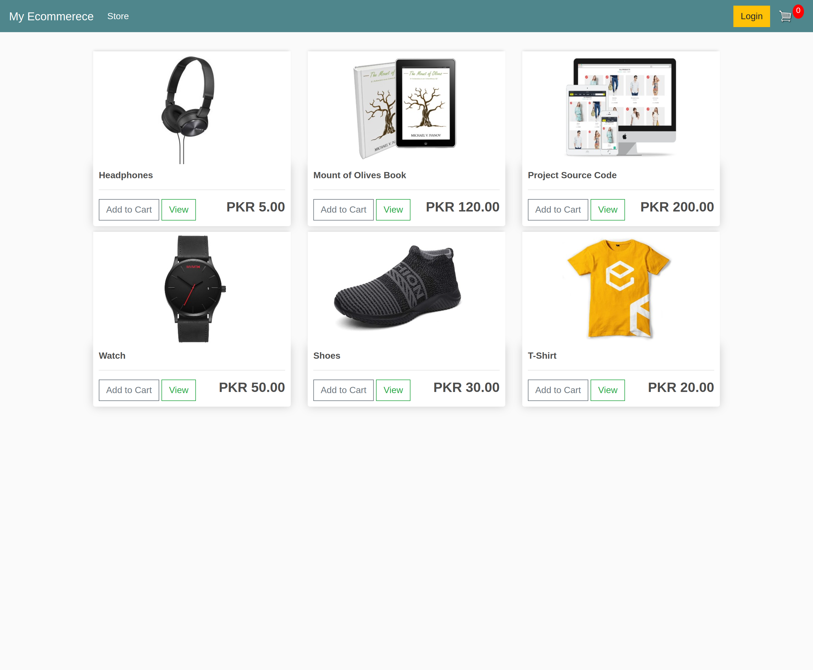
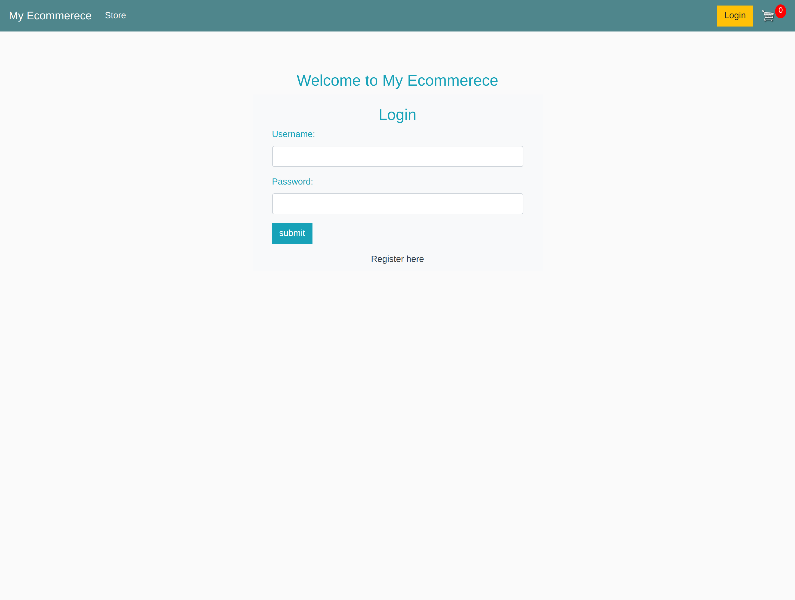
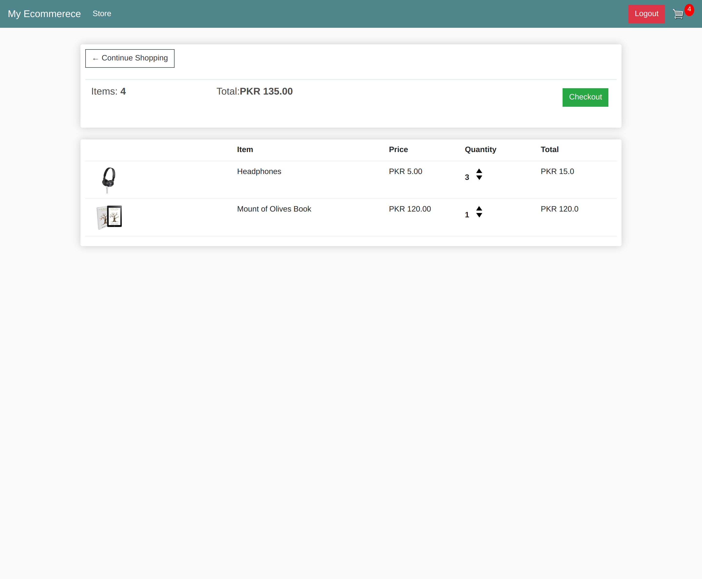
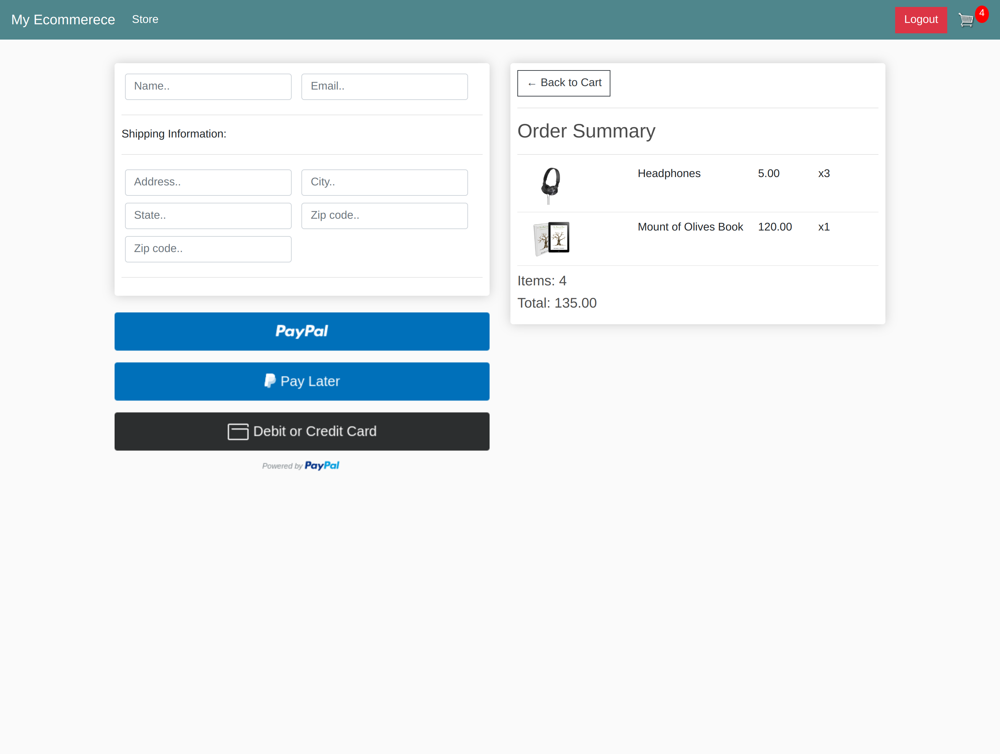

# My Ecommerce Website made With Django

## Features
* Full featured shopping cart
* User profile with orders
* Checkout process (shipping, payment method, etc)
* PayPal / credit card integration

## Download & Setup Instructions

**These instructions are for Mac and Linux users. Instructions may differ for Windows users**

* 1 - Clone project:

      git clone https://github.com/bilal-zafarr/ecommerece-site-django.git
        
* 2 - Go to project directory:

      cd ./ecommerece-site-django

* 3 - Create virtual environment: 
        
      python3 -m venv venv
        
* 4 - Activate virtual environment: 
        
      source venv/bin/activate
        
* 5 - Install requirements: 

      python -m pip install -r requirements.txt
        
* 6 - Run django server:
      
      python manage.py runserver

## Screens
#### Home Page

#### Login Page

#### Cart Page

#### Checkout Page

